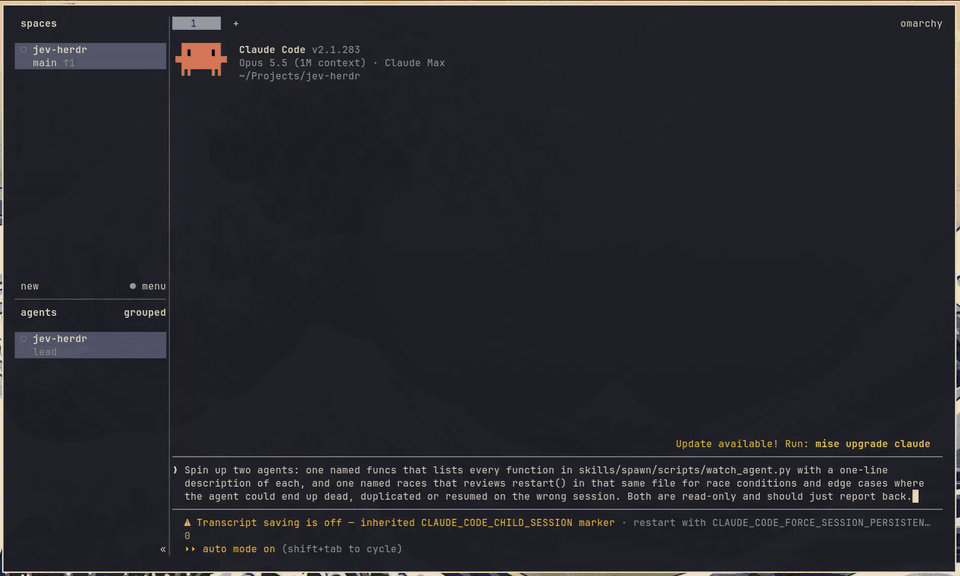

# jev-herdr

Hand subtasks to new Claude Code agents without leaving your pane. You ask Claude to
spin up an agent; [TypeSafe's Jev](https://typesafe.ai) picks the agent's **model** and
**effort** from the task, and the agent starts in a [Herdr](https://herdr.dev) pane
next to yours, where you can watch it or take over.



Not affiliated with TypeSafe or Herdr. You need your own TypeSafe API key.

## What it does

1. **Routes.** One Jev request per task answers two questions: which model (haiku,
   sonnet or opus) and how much effort (low, medium, high, xhigh or max).
2. **Places.** Claude creates the agent's pane the way Herdr's own skill says to: a
   split beside your pane that leaves your focus where it is, or wherever you ask
   ("in a new tab", "below me").
3. **Logs.** Every spawn goes to `~/.local/state/jev-herdr/decisions.jsonl` with Jev's
   answer and the tokens it billed, so you can check routing and cost from real runs.

If Jev is unreachable, the agent starts anyway on your own Claude Code default model
and effort (no `--model`/`--effort` flags), without the watcher. If your key is missing
or rejected, the same happens and Claude tells you how to fix the key.

### Watching (opt-in, experimental)

With `--watch`, a background watcher checks the agent every 5 minutes while it works:

- It sends what is on screen in the agent's pane to Jev and asks whether the agent is
  struggling (repeating failed attempts, going in circles, confused about the approach).
- Above 0.7, it stops the agent (Esc, then Ctrl+C) and resumes the same conversation
  with `claude --resume` on the next model (haiku → sonnet → opus), or at higher effort
  once on opus. At most two step-ups per agent. Your default model setting is untouched.
- An agent waiting on you (an approval or a question) is never counted as struggling.

The step-up mechanics are barely tested. 

## Requirements

- [Herdr](https://herdr.dev) 0.9.x, with Claude Code running inside a Herdr pane
- [Claude Code](https://claude.com/claude-code)
- `python3` (standard library only), `jq`
- A TypeSafe API key from [console.typesafe.ai](https://console.typesafe.ai)

Tested on Linux. macOS should work but is untested.

## Install

```bash
claude plugin marketplace add alexzfe/jev-herdr
claude plugin install jev-herdr@jev-herdr
```

Put your key where the scripts can read it:

```bash
mkdir -p ~/.config/jev-herdr
printf 'TYPESAFE_API_KEY=%s\n' 'your-key' > ~/.config/jev-herdr/env
chmod 600 ~/.config/jev-herdr/env
```

`TYPESAFE_API_KEY` in the environment works too and takes precedence. To watch every
agent without asking, add `JEV_HERDR_WATCH=1` to the same file.

## Use

Inside a Herdr pane, ask Claude to hand something off:

> Spin up an agent to find why the websocket tests are flaky.

or invoke the skill directly with `/jev-herdr:spawn <task>`. Claude ends its reply with
one line per agent, so you can see what was routed where:

```
spawned flaky-ws → opus / xhigh effort (Jev 99% sure) in w1:p4 · "Find why the websocket tests are flaky. They fail about 1 in…"
```

The scripts also work by hand:

```bash
scripts=$(echo ~/.claude/plugins/cache/jev-herdr/jev-herdr/*/skills/spawn/scripts)
$scripts/pick_model.py "Add a --verbose flag to the CLI"                   # routing only
$scripts/spawn_agent.sh leakhunt "Investigate the memory leak after hours"   # dry run
pane=$(herdr pane split --current --direction right --cwd "$PWD" --no-focus | jq -r .result.pane.pane_id)
$scripts/spawn_agent.sh --go --pane "$pane" leakhunt "Investigate the memory leak after hours"
```

`spawn_agent.sh` options: `--pane ID` is the pane to start in (required with `--go`),
`--model` / `--effort` override Jev, `--watch` turns on the watcher, `--interval SECS`
changes how often it checks.

## Cost

Jev bills input tokens only (see [TypeSafe's pricing](https://docs.typesafe.ai/models.md)).
Measured on 2026-09-30 at $0.042 per million input tokens:

| Request | Input tokens | Cost |
|---|---|---|
| Routing one spawn | ~590 | ~$0.000025 (about 40,000 spawns per dollar) |
| One watcher check | ~900, more for a taller pane | ~$0.00004 (an hour of watching is about $0.0005) |

To see your own spend, sum `input_tokens` in the log:

```bash
jq -s '[.[] | (.jev.input_tokens // .input_tokens // 0)] | add' ~/.local/state/jev-herdr/decisions.jsonl
```

## Privacy

Task descriptions are sent to TypeSafe's API for routing. With `--watch`, whatever is on
screen in the agent's pane is sent too, which can include anything the agent printed,
such as file contents or secrets.

## Tuning

`eval/eval_tasks.txt` holds labeled example tasks (`model<TAB>task`). Add your own and
run `python3 eval/run_eval.py` to see how routing matches your judgement. The step-up
threshold (0.7) and maximum steps (2) are flags on `watch_agent.py`.

## Limits

- Only the `claude` agent kind is routed; Herdr supports others.
- Jev's answers can shift slightly between calls on borderline tasks.
- The watcher stops at the agent's first idle or done. An agent that ends its turn to
  wait for background work, then resumes, is not watched after that.

## License

MIT
